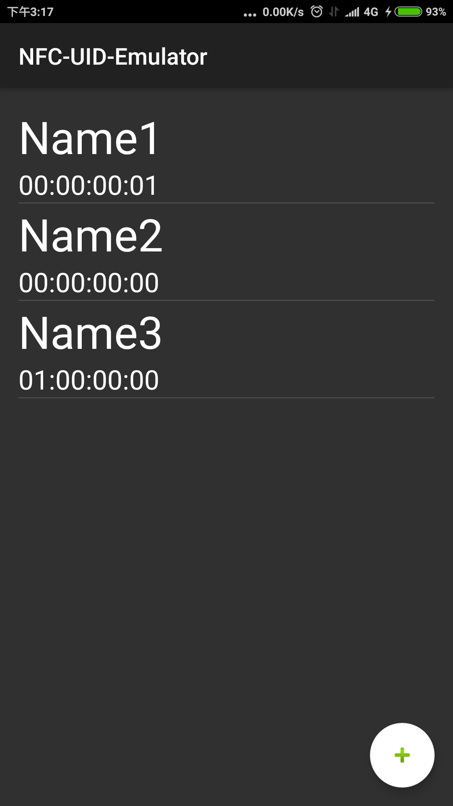
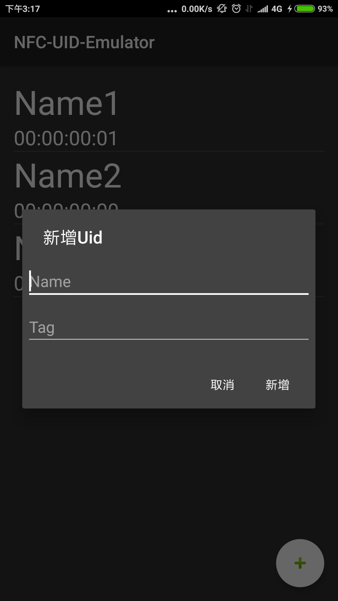
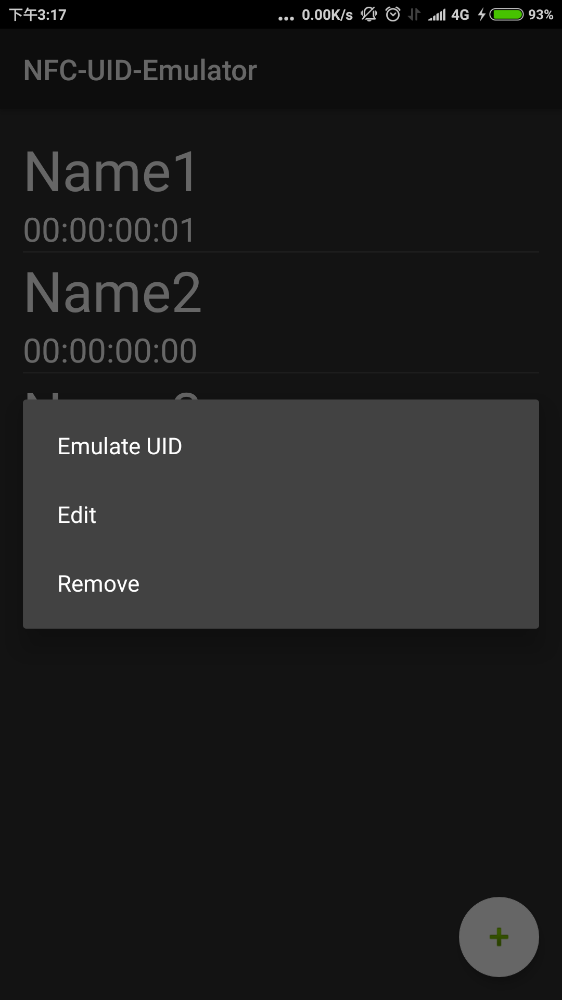

# NFC-UID-Emulator
## 原理
Mifare S50 的 Sector0中的Block0是唯讀的uid碼，一般的Rfid tag無法複寫uid。

部分門禁卡僅使用這個uid來驗證，因此只要複製uid就可以模擬門禁卡。

Android的NFC在模擬Rfid時的tag碼可以在/system/etc/libnfc-nxp.conf中設定。*需ROOT權限*
## 目的
 雖然可以手動改寫文件來達成所需效果，但是若有多組門禁卡則必須手動改來改去，很煩躁。
 
 市面有現成APP做類似功能，但是要錢，乾脆自己寫。
 
 ## 遇到的障礙
 
 * 沒寫過App，處理UI很煩躁。
 * Android 6.0以上版本的權限問題很煩躁。
 * 沒用過Shell command，而Root權限的功能都必須使用Shell command，很煩躁。
 
 花比較多時間才查到的Command
 ```
 # 重新掛載system區為可讀可寫
 mount -o remount,rw /system
 # 重新掛載system區為唯讀
 mount -o remount,ro /system
 # NFC關閉
 svc nfc disable
 # NFC開啟
 svc nfc enable
 ```
---------------------------------------
## Screenshot



---------------------------------------
## 測試機規格
* Xiaomi 5s Plus
* Android 6.0.1
* MIUI 8 Global 7.5.11 Beta ROM
* *必須ROOT、解鎖System區*
